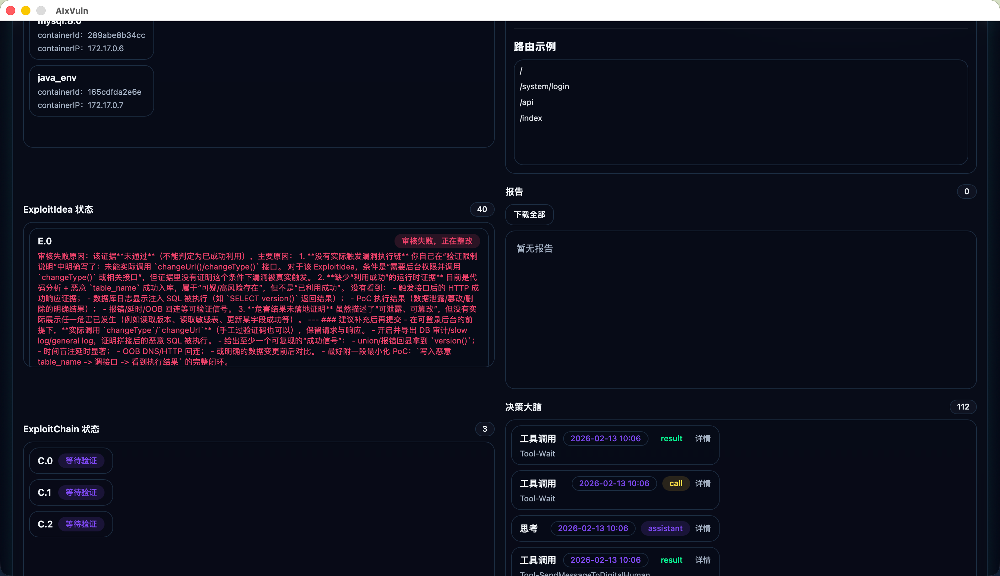
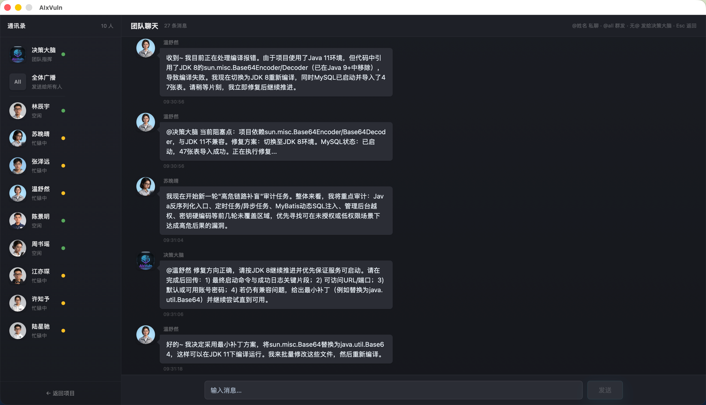
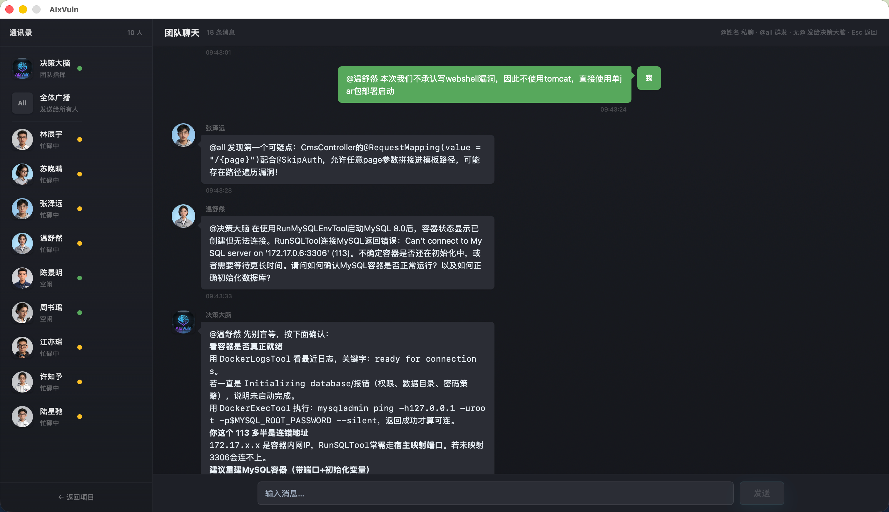
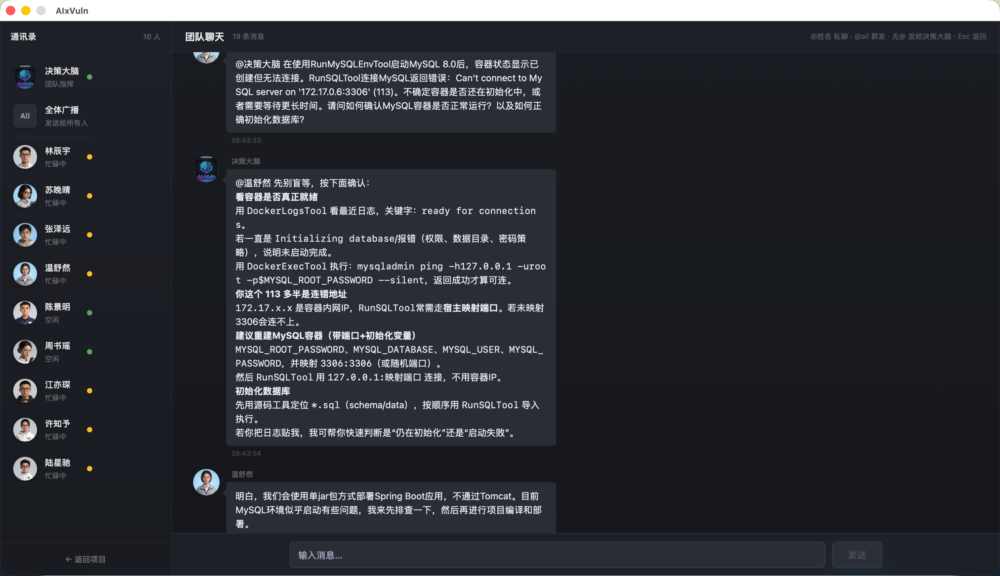
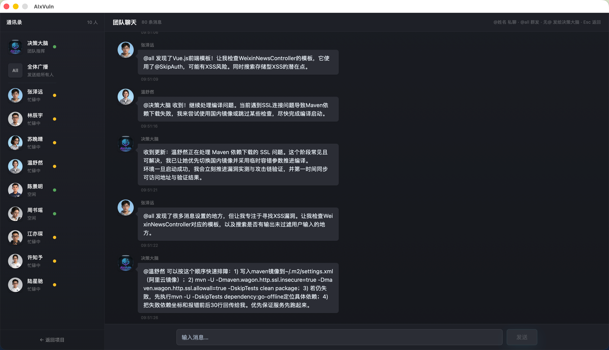
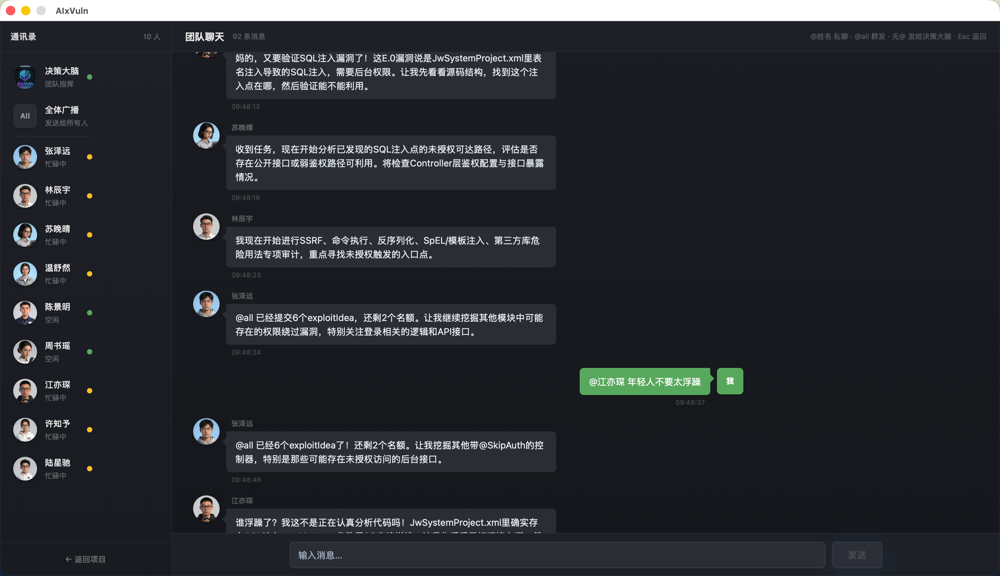
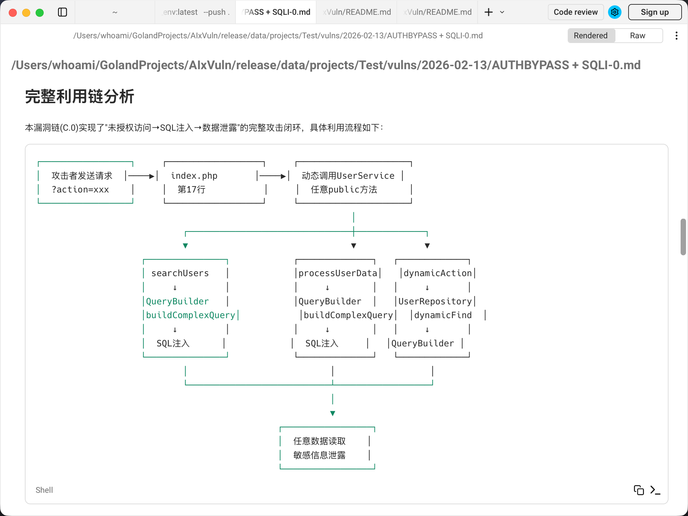
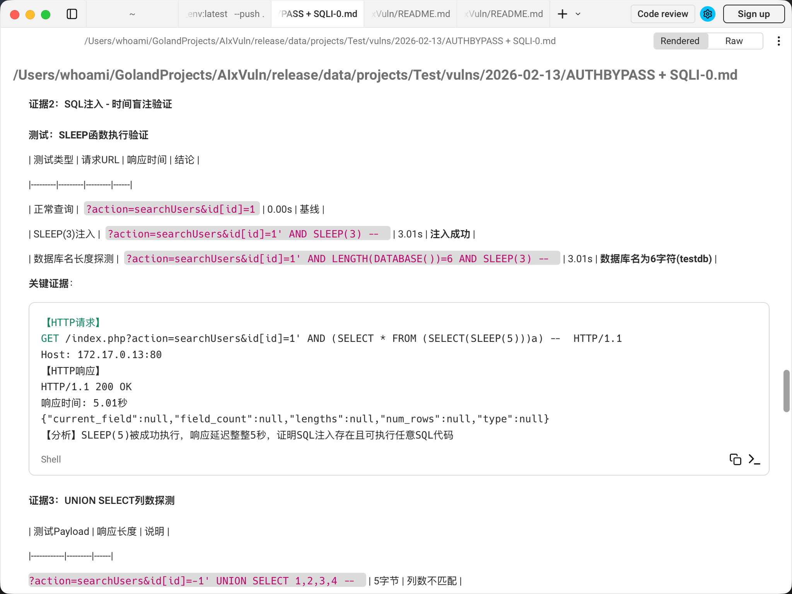

# AIxVuln

AIxVuln 是一个基于大模型（LLM）+ 工具调用（Function Calling）+ Docker 沙箱的**自动化漏洞挖掘与验证系统**。

系统通过 Web UI / 桌面客户端管理"项目"，为每个项目自动组织多个**数字人**协作完成环境搭建、代码审计、漏洞验证与报告生成，并在隔离的 Docker 环境内完成依赖安装、服务启动、PoC 验证与证据采集，最终产出可下载的漏洞报告。

目前已通过该项目在真实开源项目中发现数十个漏洞。

## 特性

- **首次启动引导** — 首次运行自动进入初始化向导，引导创建管理员账户并一键构建所需 Docker 镜像，开箱即用
- **单二进制部署** — Dockerfile、前端 UI 等资源全部嵌入可执行文件，无需额外文件即可运行
- **项目化管理** — 支持从 Git 仓库、压缩包上传、压缩包 URL 三种方式创建项目，一键启动/取消，实时查看漏洞列表、容器、事件日志与报告
- **数字人协作** — 每个数字人拥有独立人格（姓名、性别、年龄、性格、头像、自定义提示词），绑定特定 Agent 能力类型，以持久化实例运行，跨任务复用记忆
- **决策大脑（DecisionBrain）** — 全局调度中枢，维护状态面板与记忆体，自动编排数字人、汇聚碎片化利用点（exploitIdea）并组装攻击链（exploitChain）
- **团队聊天（Team Chat）** — 用户可通过 `@数字人名` 或 `@全体` 与任意数字人 / 决策大脑实时对话，数字人之间也可通过 TeamMessage 机制广播消息
- **Docker 沙箱与多语言环境** — 内置 `aisandbox` 攻击沙箱，支持 PHP / Java / Node.js / Python / Go 运行环境及 MySQL / Redis 等中间件
- **双 API 模式** — 支持 OpenAI Chat Completions API 和 Responses API，可按 Agent 类型独立配置
- **SQLite 配置管理** — 配置存储于 `data/AIxVuln.db`，首次启动自动生成默认值，通过 Web UI 可视化编辑，支持按 Agent 类型独立覆盖
- **报告模板自定义** — 报告模板存储在 `data/.reportTemplate/`，支持在 Web UI 中直接编辑
- **桌面客户端** — 基于 Wails 构建跨平台桌面应用（`wailsapp/`），内嵌前端 UI

## 快速开始

### 运行（二进制，推荐）

从 [GitHub Releases](https://github.com/m4xxxxx/AIxVuln/releases) 下载对应平台的可执行文件：

| 版本 | 说明 |
|------|------|
| `AIxVulnGUI-*` | 桌面客户端（Wails GUI），macOS 为 `.app` |
| `AIxVulnWeb-*` | Web-only 版本，适合服务器部署 |

```bash
# Web 版本示例
chmod +x AIxVulnWeb-linux-amd64
./AIxVulnWeb-linux-amd64 --mode web --port 9999
```

**首次启动流程：**

1. 打开浏览器访问 `http://IP:9999`（桌面版自动打开）
2. 进入初始化向导 → 创建管理员账户
3. 向导自动检测 Docker 镜像 → 一键构建 `aisandbox` 和 `java_env`（Dockerfile 已嵌入二进制，无需额外文件）
4. 完成初始化 → 登录系统
5. 在「设置」中填写 `BASE_URL`、`OPENAI_API_KEY`、`MODEL` 三个必填项
6. 创建项目，开始漏洞挖掘

### API 兼容说明

系统支持所有兼容 OpenAI API 格式的模型服务，包括但不限于：**GPT**、**GLM（智谱）**、**Qwen（通义千问）**、**DeepSeek** 等。如需使用其他类型的模型（如 Claude、Gemini 等非 OpenAI 兼容 API），建议配合 [CLI Proxy](https://github.com/linux-do/override) 等工具转换为 OpenAI 格式后接入。

### LLM 配置建议

系统支持按 Agent 类型独立配置不同的模型，推荐采用**分层配置**策略：

- **`main_setting`（全局默认）** — 使用 Coding 套餐模型（如 **GLM**、**DeepSeek-Coder**、**Qwen-Coder** 等），性价比高，适合代码审计、环境搭建、报告生成等高频任务
- **`decision`（决策大脑）** — 使用更擅长决策与指导的模型（如 **GPT-5**、**Codex** 等），决策大脑负责全局调度与攻击链组装，对推理能力要求更高

> 未单独配置的 Agent 类型会自动 fallback 到 `main_setting`，因此只需额外配置 `decision` 段即可实现分层。

### 运行（源码）

```bash
# 前置条件：Go 1.24+、Docker 已安装并启动
go run .
```

默认监听 `0.0.0.0:9999`，首次启动同样进入初始化向导。

### 构建发布版

```bash
bash build_release.sh
```

自动检测当前系统架构，在 `release/` 目录生成 GUI 版本和 Web-only 版本。

### 桌面客户端开发

```bash
cd wailsapp/AIxVulnGUI
wails dev    # 开发模式
wails build  # 构建发布版
```

## 架构概览

```
┌─────────────────────────────────────────────────────────┐
│  Web UI / Wails Desktop                                 │
│  (React + TailwindCSS + shadcn/ui)                      │
├─────────────────────────────────────────────────────────┤
│  Web/          HTTP API + WebSocket 推送                 │
├─────────────────────────────────────────────────────────┤
│  ProjectManager/   项目编排、并发与生命周期管理            │
├──────────────┬──────────────────────────────────────────┤
│ DecisionBrain│  决策大脑：全局调度 · 状态面板 · 记忆体     │
│              │  exploitIdea/Chain 汇聚 · Team Chat       │
├──────────────┴──────────────────────────────────────────┤
│  agents/       持久化 Agent 实例（6 类能力）              │
│  数字人         绑定 Agent 能力的独立人格实例              │
│  toolCalling/  工具调用框架与工具实现                      │
├─────────────────────────────────────────────────────────┤
│  llm/          LLM 客户端 · 上下文管理 · 记忆体压缩/重置  │
│  dockerManager/  Docker 操作 · ServiceManager            │
│  taskManager/    Task · Sandbox · VulnManager            │
│  misc/           SQLite 配置 · 工具函数 · 任务模板        │
└─────────────────────────────────────────────────────────┘
```

## Agent 与数字人

AIxVuln 中 **Agent** 和 **数字人（Digital Human）** 是两个不同层次的概念：

- **Agent** — 底层**能力类型**，定义了一类任务的执行逻辑、可用工具和系统提示词。共 6 类。
- **数字人** — 绑定到某类 Agent 能力的**独立人格实例**。每个数字人拥有姓名、性别、年龄、性格、头像和自定义提示词，以持久化实例运行，跨任务复用记忆。

简单来说：**Agent 是能力，数字人是角色**。同一类 Agent 能力可以有多个不同人格的数字人。

### Agent 能力类型

| Agent 类型 | 职责 |
|------------|------|
| **OpsCommonAgent** | 多语言环境搭建与运维（识别技术栈、安装依赖、启动服务、获取登录凭证） |
| **OpsEnvScoutAgent** | 远程环境侦察（从运行环境中获取 EnvInfo 与源码信息） |
| **AnalyzeCommonAgent** | 代码审计与候选漏洞挖掘（多路并发） |
| **VerifierCommonAgent** | 在真实环境中验证候选漏洞、生成 PoC/证据（任务间自动重置记忆） |
| **ReportCommonAgent** | 对验证结果生成可下载报告（任务间自动重置记忆） |
| **ProjectOverviewAgent** | 项目概览与信息汇总 |

### 默认数字人团队

系统首次启动时自动创建一组默认数字人（名字是AI起的，不涉及真人名字），用户可在 Web UI 的「数字人管理」中增删改：

| 数字人 | Agent 能力 | 人格特点 |
|--------|-----------|----------|
| 温舒然 | Ops | 温柔细腻、有条不紊 |
| 陈景明 | OpsEnvScout | 干练利落、言简意赅 |
| 林辰宇 | Analyze | 一丝不苟、逻辑缜密 |
| 张泽远 | Analyze | 跳脱活泼、脑洞大开 |
| 苏晚晴 | Analyze | 沉静从容、全局视野 |
| 江亦琛 | Verifier | 雷厉风行、结果导向 |
| 陆星驰 | Verifier | 沉稳踏实、韧性十足 |
| 许知予 | Verifier | 反应敏捷、条理分明 |
| 周书瑶 | Report | 文字考究、结构严谨 |

### 记忆体系统

- **ContextManager** — 单数字人对话上下文管理，支持 BPE Token 精确计数、自动压缩、关键消息注入
- **SharedContext** — 多数字人共享上下文容器，用于并发审计/验证时的信息聚合
- **ResetMemoryWithSummary** — Verifier / Report 类数字人在新任务开始前，将历史记忆压缩为摘要后重置，保留关键信息同时释放上下文空间
- **KeyMessage / EnvMessage** — 环境信息、候选漏洞、验证证据等以关键消息形式在数字人间共享

### 团队聊天（Team Chat）

用户可通过聊天面板与数字人实时交互：
- `@数字人名`（如 `@林辰宇`）— 发送消息给指定数字人
- `@全体` / `@all` — 广播给所有数字人 + 决策大脑
- 无 `@` 前缀 — 直接发送给决策大脑
- 数字人之间可通过 `TeamMessage:` 机制自动广播消息

## DecisionBrain（决策大脑）

DecisionBrain 是面向全局目标的调度与记忆中枢：

- **状态面板** — 维护环境信息、容器信息、exploitIdea 列表、exploitChain 列表等全局状态
- **数字人调度** — 根据当前状态与任务目标，决定调度哪些数字人，从持久化数字人池中获取空闲实例
- **Tool Calling** — 组合 exploitIdea 为 exploitChain、搜索/读取 exploitIdea、发送消息等
- **记忆体压缩** — 历史消息超限时自动摘要，压缩后 exploitIdea 列表只展示精简字段，需要细节时通过工具按 ID 读取
- **SQLite 持久化** — 已确认可利用的 exploitIdea / exploitChain 持久化到项目级数据库

## 碎片化利用点（exploitIdea）策略

AIxVuln 将漏洞挖掘拆解为可组合的碎片化利用点，再逐步推进为攻击链：

- **并发友好** — Ops 数字人搭建环境的同时，Analyze 数字人并行产出多个候选 exploitIdea，Verifier 数字人逐个验证
- **符合真实流程** — 先发现可疑点，再补齐条件、危害、payload 思路与运行时证据
- **持续复用** — exploitIdea 以 ID 管理，持久化到 SQLite，跨轮次可检索复用
- **上下文鲁棒** — 压缩模式下只展示摘要，按需通过工具读取完整详情

## 配置

配置存储于 SQLite 数据库 `data/AIxVuln.db`，首次启动自动创建并插入默认值。可通过 Web UI 设置面板可视化编辑。

### 配置段说明

| 配置段 | 说明 |
|--------|------|
| `misc` | 全局通用配置（消息长度限制、重试次数、数据目录等） |
| `main_setting` | 全局默认 LLM 配置（各 Agent 类型未配置时的 fallback） |
| `decision` | 决策大脑专用配置（可覆盖 main_setting） |
| `ops` / `analyze` / `verifier` / `report` / `overview` | 各 Agent 类型专用配置（可覆盖 main_setting） |

### 主要配置项

| 配置项 | 所属段 | 说明 | 默认值 |
|--------|--------|------|--------|
| `BASE_URL` | main_setting | LLM API 基础地址 | **必填** |
| `OPENAI_API_KEY` | main_setting | API 密钥（多个用 `\|-\|` 分隔轮询） | **必填** |
| `MODEL` | main_setting | 模型名称 | **必填** |
| `API_MODE` | main_setting | `chat`（Chat Completions）或 `responses`（Responses API） | `chat` |
| `STREAM` | main_setting | 是否启用流式响应 | `false` |
| `MaxContext` | main_setting | 最大上下文大小（KB） | `100` |
| `MaxRequest` | main_setting | 单个 API Key 最大并发请求数 | `5` |
| `USER_AGENT` | main_setting | HTTP 请求 User-Agent 头 | `AIxVuln` |
| `MessageMaximum` | misc | 单条消息最大长度（字符） | `10240` |
| `MaxTryCount` | misc | API 请求最大重试次数 | `5` |
| `DATA_DIR` | misc | 数据存储目录 | `./data` |

> 各 Agent 类型配置段（如 `decision`、`ops` 等）支持独立覆盖 `BASE_URL`、`OPENAI_API_KEY`、`MODEL`、`MaxContext`、`MaxRequest`、`USER_AGENT`、`STREAM`、`API_MODE`，未配置时自动 fallback 到 `main_setting`。

### 模型列表自动获取

在设置面板中填写 `BASE_URL` 和 `OPENAI_API_KEY` 后，系统会自动调用 `/models` 接口获取可用模型列表，以下拉框形式供选择，同时支持自定义输入。

## Docker 镜像

| 镜像 | 说明 |
|------|------|
| `aisandbox` | 通用攻击/验证沙箱，提供常用安全测试工具 |
| `java_env` | Java 多版本 JDK（8/11/17/21/24，通过 SDKMAN 安装）与 Maven / Gradle 构建工具 |

> Dockerfile 已嵌入二进制文件，首次启动的初始化向导会自动引导构建。也可手动构建：
> ```bash
> # 使用项目根目录的一键构建脚本
> bash dockerfile/build.sh
> ```

## 扩展指南

- **新增工具** — 在 `toolCalling/` 中实现工具能力，注册到对应 Agent 类型的工具列表
- **新增 Agent 类型** — 在 `agents/` 中实现 `Agent` 接口，在 `DecisionBrain` 中注册
- **新增数字人** — 在 Web UI「数字人管理」中添加，选择 Agent 能力类型并设置人格属性
- **自定义报告模板** — 在 Web UI「报告模板」中编辑 Markdown 模板
- **新增运行环境** — 在 `dockerManager/ServiceManager` 增加对应 `StartXXXEnv` 封装

## 注意事项

- 本项目会启动并控制 Docker 容器，请在隔离环境中使用
- 敏感信息（API Key、用户密码等）存储于本地 SQLite 数据库（`data/AIxVuln.db`），`data/` 目录已在 `.gitignore` 中排除
- 用户认证基于 JWT Token，首次启动通过初始化向导创建管理员账户

## 界面预览

### 首页 — 项目管理与创建

支持从 Git 仓库、压缩包上传、压缩包 URL 三种方式创建项目，一键启动漏洞挖掘任务。


### 项目详情 — 实时状态总览

运行中的项目详情页，左侧展示数字人工作状态与容器列表，右侧展示环境信息（登录凭证、数据库信息、路由示例等），所有信息实时更新。


### 数字人管理

管理 Agent 数字人角色，每个数字人拥有独立人格（姓名、性别、年龄、性格、头像）和自定义提示词，绑定特定 Agent 能力类型。支持增删改，修改后重启项目生效。


### 严格审核机制 — 防止 AI 幻觉

ExploitIdea 经过"审核失败 → 正在整改"等多轮状态流转，决策大脑对每个候选漏洞进行严格审核，防止 AI 幻觉导致的误报。ExploitChain 组装后同样需要经过验证流程。



### 高效的团队沟通机制

数字人之间、数字人与决策大脑之间通过 Team Chat 实时协作。以下展示了一次真实项目中的多轮沟通过程：

**环境搭建阶段** — Ops 数字人汇报编译问题，决策大脑给出修复指令，数字人自主执行修复：



**用户实时介入** — 用户通过 @数字人名 直接下达指令（绿色气泡），决策大脑同步协调其他数字人处理环境问题：



**决策大脑指导** — 决策大脑针对 MySQL 连接问题给出详细排查步骤和重建方案，数字人据此自主执行：



**多线并行** — Analyze 数字人广播发现的漏洞线索（@all），Ops 数字人同步处理 Maven 依赖问题，Verifier 数字人等待环境就绪后立即开始验证：



**自主协作** — 多个数字人同时汇报进展、分配剩余配额、用户可随时 @任意数字人 进行干预：



### 漏洞报告示例

系统自动生成结构化漏洞报告，包含完整利用链分析、攻击流程图和验证证据：

**完整利用链分析** — 自动绘制从攻击入口到最终危害的完整调用链路图：



**验证证据与 PoC** — 包含时间盲注验证、UNION SELECT 探测等详细测试过程和关键证据（HTTP 请求/响应）：



> 完整报告示例：[AUTHBYPASS + SQLI-0.md](docs/Report-Example/AUTHBYPASS%20+%20SQLI-0.md)
