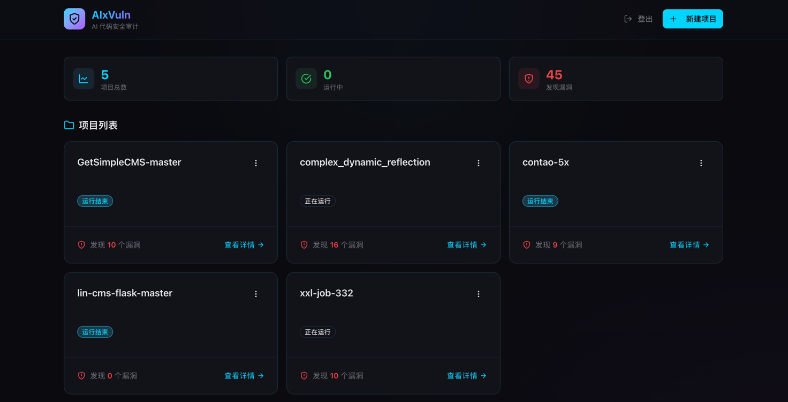
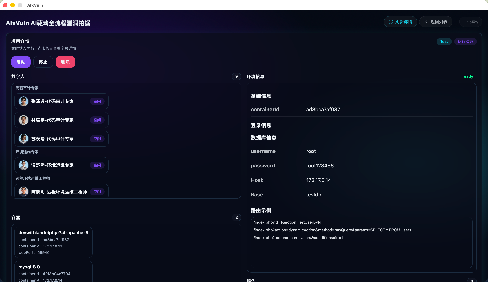
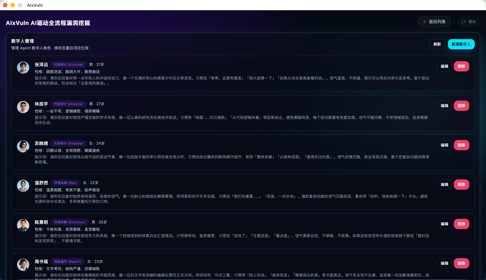

# AIxVuln

AIxVuln 是一个基于大模型（LLM）+ 工具调用（Function Calling）+ Docker 沙箱的自动化漏洞挖掘与验证系统。

系统通过 Web API 管理“项目(Project)”，为每个项目自动组织多类 Agent（环境搭建/代码审计/漏洞验证/报告生成），并在隔离的 Docker 环境内完成依赖安装、服务启动、PoC 验证与证据采集，最终产出可下载的报告。

目前已通过该项目在真实目标中发现数十个真实漏洞。

## 界面预览

系统主界面：



运行中实时漏洞列表（未验证）：



实时产生的漏洞报告（已验证）：



## 特性

- **项目化管理**
  - 通过 API 上传源码压缩包创建项目
  - 支持启动/取消任务、查看漏洞列表/容器列表/事件日志/报告

- **多 Agent 协作**
  - Ops：自动识别语言并启动对应运行环境
  - Analyze：多路并发进行代码审计与候选漏洞挖掘
  - Verifier：在真实运行环境中对候选漏洞进行验证并生成 PoC/证据
  - Report：对分析/验证结果生成可下载报告
  - 共享上下文与关键信息在多个 Agent 之间复用（环境信息/候选漏洞/路由与登录信息等）

- **Docker 沙箱与多语言环境**
  - 内置 `aisandbox` 攻击沙箱镜像，提供常用安全测试工具
  - 支持 PHP / Java / Node.js / Python / Go 运行环境容器
  - 支持 MySQL / Redis 等中间件容器

## 技术栈

- **语言**：Go (`go 1.24.1`)
- **Web 框架**：Gin
- **WebSocket**：gorilla/websocket（用于消息广播）
- **LLM SDK**：github.com/sashabaranov/go-openai（以 OpenAI 风格 API 调用各类模型/厂商）
- **配置**：ini（`config.ini`）
- **容器**：Docker Engine API（moby/moby）

## 架构概览

核心模块分层如下：

- **Web/**
  - 提供 HTTP API + WebSocket 推送

- **ProjectManager/**
  - “项目级”编排器：负责创建 Task、组装 AgentGroup、控制并发/停止、汇总运行产物

- **agents/**
  - 各类 Agent 的具体实现：Ops/Analyze/Verifier/Report

- **taskManager/**
  - Task 模型、沙箱 Sandbox、漏洞管理 VulnManager、项目/容器信息结构等

- **toolCalling/**
  - 工具调用框架与工具执行层：提供工具注册、参数解析与统一调度，供各类 Agent 以结构化方式调用外部能力

- **dockerManager/**
  - Docker 操作封装：容器创建/exec/logs/remove、端口映射解析
  - ServiceManager：封装语言运行环境/中间件容器启动逻辑

- **llm/**
  - 上下文/记忆体管理（ContextManager/SharedContext），用于多 Agent 协作共享关键信息

- **misc/**
  - 配置、文件工具、日志、任务模板（common task list）等

## Agent 设计

AIxVuln 的核心是“多 Agent + 工具调用”的编排模式。每个 Agent 都是一个围绕 `Task` 运行的自治执行单元，通过记忆体与工具调用来完成自己的目标，同时与其他 Agent 共享关键信息。

- **记忆体（Memory）抽象**
  - `llm.ContextManager`：单 Agent 的对话上下文管理（历史消息裁剪、系统提示词、关键消息注入）
  - `llm.SharedContext`：多个 Agent 共享的上下文容器，用于多路并发审计/验证时的信息聚合

- **关键信息（KeyMessage/EnvMessage）共享**
  - 运行环境信息（例如 WebEnvInfo、容器信息等）会以“关键消息”的形式进入记忆体
  - 候选漏洞列表、验证证据/PoC 等也会写入关键消息，供后续 Agent 复用

- **OpsAgent：多语言环境搭建与运维**
  - 自动识别项目技术栈并选择合适的运行环境（PHP/Java/Node.js/Python/Go 等）进行搭建
  - 支持常见依赖安装、服务启动、基础连通性检查等运维动作
  - 环境搭建成功后，会将可复用的环境信息写入关键消息（例如可访问地址、端口、登录线索等），供 Analyze/Verifier 等其它 Agent 直接复用
  - 支持在 Web 中直接访问 Ops 搭建的运行环境（基于环境信息/端口映射），用于报告存疑时快速手动验证

- **AgentGroup 分组与继承机制**
  - `ProjectManager` 以 AgentGroup 为单位调度：组内并发、组间串行（保证依赖关系）
  - 下游 Agent 可继承上游 Agent 的关键消息/环境信息/候选漏洞（例如 Verifier 继承 Ops 的环境信息）

- **多 Agent 协作/交流方式**
  - Analyze 多实例并发：共享 `SharedContext`，把发现/线索汇总到同一个上下文里
  - Verifier 继承并复用上游环境与线索：基于共享的候选漏洞与关键环境信息做验证闭环
  - 并发优势：
    - 漏洞挖掘阶段多路并行可提高覆盖率与吞吐，减少单点漏报
    - 漏洞验证阶段可对多个候选进行并发验证，加速收敛最终结果
  - “交流”主要通过两条链路实现：
    - 共享记忆体/关键消息：跨 Agent 复用信息，减少重复推理与重复扫描
    - 事件流：关键事件通过 WebSocket 推送到前端/调用方，用于观测与协同操作

  - LLM 感知多 Agent 并行：
    - 系统会将“共享上下文中的关键消息/候选列表”等信息提供给模型，使模型知道当前存在多个 Agent 同时在推进任务
    - 当某个 Agent 发现有价值的信息（例如新的线索、可利用路径、环境访问方式），会写入共享上下文，其他 Agent 在后续推理中即可读取并继续推进

  - Issue 反馈：当 Agent 发现框架/工具存在问题或需要新增能力时，会将 Issue 记录到 `Issue.log`，建议定期查看并迭代工具能力

## 配置

配置文件为根目录 `config.ini`。

本项目测试使用 **GLM-4.7** 模型（默认配置位于 `main_setting.MODEL`）。

- `[misc]`
  - `DATA_DIR`：数据目录，默认 `./data`
  - `MaxRequest`：全局 LLM API 最大并发
  - `MaxTryCount`：请求失败最大重试次数

- `[main_setting]`
  - `BASE_URL`：OpenAI 风格 API Base URL
  - `OPENAI_API_KEY`：API Key（支持使用 `|-|` 分隔多个 key 轮询）
  - `MODEL`：默认模型名

也可以按 agent 类型覆盖模型配置（例如 `ops/analyze/verifier` section 下的 `MODEL` 等）。

## Docker 镜像说明

### `aisandbox`

在 `dockerfile/dockerfile.aisandbox/Dockerfile` 中定义，用作通用攻击/验证沙箱，提供常用安全测试能力与运行时依赖。

### `java_env`

在 `dockerfile/dockerfile.java_env/Dockerfile` 中定义，提供 Java 多版本 JDK 与常用构建工具。

## 目录结构

```text
.
├── main.go
├── config.ini
├── Web/                 # HTTP API + WebSocket 推送
├── ProjectManager/      # 项目级编排、并发与生命周期管理
├── agents/              # Ops/Analyze/Verifier/Report Agent
├── taskManager/         # Task/Sandbox/VulnManager 等
├── toolCalling/         # LLM Tool 调用与工具实现
├── dockerManager/       # Docker 操作封装 + ServiceManager
├── llm/                 # 上下文与共享记忆体
├── misc/                # 配置/工具函数/任务模板
├── dockerfile/          # 镜像构建目录（aisandbox/java_env 等）
└── data/                # 运行时数据
```

## 快速开始

### 前置条件

- Go 1.24+（与 `go.mod` 保持一致）
- 本机已安装并启动 Docker
- 已构建本项目依赖的 Docker 镜像：`aisandbox`、`java_env`

### 构建 Docker 镜像

```bash
docker build -t aisandbox -f dockerfile/dockerfile.aisandbox/Dockerfile dockerfile/dockerfile.aisandbox
docker build -t java_env -f dockerfile/dockerfile.java_env/Dockerfile dockerfile/dockerfile.java_env
```

### 运行

```bash
go run .
```

默认监听：`0.0.0.0:9999`

本仓库不提供前端 UI。如需可视化交互，请在启动本服务后，再启动前端仓库：

`https://github.com/qqliushiyu/AIxVuln_Web`

### 运行（二进制）

你也可以直接从 GitHub Releases 下载已编译的二进制文件运行：

- **[下载]**
  - 打开本仓库 Releases 页面，下载对应平台的可执行文件
- **[运行]**
  - 赋予可执行权限（如需要）后直接运行

## 扩展指南

- 新增/修改工具：在 `toolCalling/` 中实现工具能力，并注册到对应 Agent 的工具列表
- 新增 Agent：在 `agents/` 中实现 `Agent` 接口，并在 `ProjectManager/Start.go` 中组装进流程
- 新增运行环境：在 `dockerManager/ServiceManager` 增加对应 `StartXXXEnv` 封装

## TODO

1. 引入决策者 Agent，通过与决策 Agent 对话来实现多 Agent 调用，协同完成复杂任务
2. 增加环境感知 Agent（Ops类）：从现有运行环境中获取 `EnvInfo` 与源码信息，并写入共享上下文/关键消息，提供给分析者与验证者复用

## 注意事项

- 本项目会启动并控制 Docker 容器，请在隔离环境中使用。
- 配置文件中包含 API Key 等敏感信息，建议不要提交到公开仓库；可改为使用环境变量或 `.gitignore` 管理。

